# 📗 คู่มือการติดตั้งและใช้งาน NEXTSTEP

> **NEXTSTEP (NEX)** — Career Path Finder สำหรับนักเรียน ม.3–ม.6
> แพลตฟอร์มวางแผนเส้นทางสู่มหาวิทยาลัยแบบ gamified เชื่อมข้อมูล TCAS จริงจาก Supabase

<p align="center">
  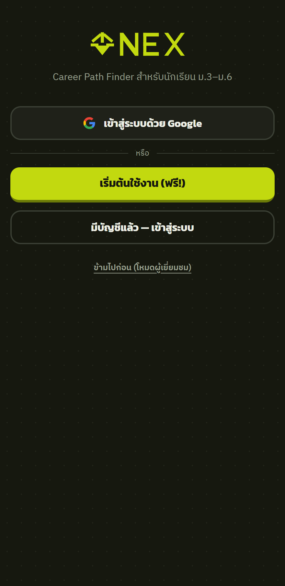
</p>

---

## 📑 สารบัญ
1. [ความต้องการของระบบ](#1-ความต้องการของระบบ)
2. [การติดตั้ง](#2-การติดตั้ง)
3. [การตั้งค่า Supabase](#3-การตั้งค่า-supabase)
4. [การรันแอปพลิเคชัน](#4-การรันแอปพลิเคชัน)
5. [คู่มือการใช้งาน (ทีละหน้า)](#5-คู่มือการใช้งาน)
6. [โครงสร้างโปรเจกต์](#6-โครงสร้างโปรเจกต์)
7. [การแก้ปัญหาที่พบบ่อย](#7-การแก้ปัญหาที่พบบ่อย)

---

## 1. ความต้องการของระบบ

| รายการ | ขั้นต่ำ |
|--------|---------|
| **Node.js** | v18 ขึ้นไป (สำหรับรัน dev server) |
| **เว็บเบราว์เซอร์** | Chrome / Edge / Firefox เวอร์ชันล่าสุด |
| **อินเทอร์เน็ต** | จำเป็น (เชื่อม Supabase + โหลด CDN: Tailwind, ฟอนต์) |
| **บัญชี Supabase** | (มีให้แล้ว — โปรเจกต์ `cbsteufryuiwcqbgcfle`) |

> ⚠️ **ต้องรันผ่าน local server เท่านั้น** — เปิดไฟล์ `index.html` ตรงๆ (`file://`) จะใช้ไม่ได้ เพราะ Supabase บล็อก CORS

---

## 2. การติดตั้ง

### 2.1 โคลนโปรเจกต์
```bash
git clone https://github.com/Nextstep123-star/NEXSTEP.git
cd NEXSTEP/nextstep-demo
```

### 2.2 ไม่ต้อง `npm install`
แอปเป็น **vanilla HTML/CSS/JS** ไม่มี build step — โหลด dependency ทั้งหมดผ่าน CDN:
- Tailwind CSS (+ forms plugin)
- ฟอนต์: Kanit, IBM Plex Sans Thai, IBM Plex Mono
- `@supabase/supabase-js` v2

มีเพียง `serve.js` (Node static server) ที่ใช้รัน — ไม่ต้องติดตั้งแพ็กเกจใดๆ

---

## 3. การตั้งค่า Supabase

ค่า config อยู่ใน [`js/config.js`](../js/config.js) — **ตั้งไว้พร้อมใช้แล้ว**:

```js
const NEXTSTEP_CONFIG = {
  SUPABASE_URL: "https://cbsteufryuiwcqbgcfle.supabase.co",
  SUPABASE_KEY: "sb_publishable_...",   // publishable key ปลอดภัยสำหรับ client
};
```

> 🔒 คีย์นี้เป็น **publishable key** ปลอดภัยที่จะอยู่ในโค้ดฝั่ง client เพราะข้อมูลถูกป้องกันด้วย **Row Level Security (RLS)** — ผู้ใช้อ่าน/เขียนได้เฉพาะข้อมูลตัวเอง

### ตารางในฐานข้อมูล
| กลุ่ม | ตาราง | สิทธิ์ |
|-------|-------|--------|
| **Catalog** (อ่านสาธารณะ) | `programs` (4,874) · `universities` (141) · `faculties` (14) · `program_roadmaps` (13,676) · `program_admission_rounds` (view, 38,557) | anon อ่านได้ |
| **User** (เจ้าของเท่านั้น) | `users_profile` · `user_preferences` · `user_paths` · `user_grades` · `user_scores` · `user_quest_status` | RLS `auth.uid() = id` |
| **เนื้อหา** | `news` · `events` | อ่านสาธารณะ |

---

## 4. การรันแอปพลิเคชัน

```bash
cd nextstep-demo
node serve.js
```

จะได้ผลลัพธ์:
```
NEXT_STEP → http://127.0.0.1:5173
```

เปิด **http://127.0.0.1:5173** ในเบราว์เซอร์ → จะเห็นหน้า splash (โลโก้ NEX สีไลม์) แล้ว fade เข้าหน้าเข้าสู่ระบบ

> เปลี่ยนพอร์ตได้ด้วย `PORT=8080 node serve.js`

---

## 5. คู่มือการใช้งาน

### 5.1 เข้าสู่ระบบ / สมัครสมาชิก


มี 3 ทางเลือก:
- **เข้าสู่ระบบด้วย Google** (OAuth — ต้องเปิด provider ใน Supabase ก่อน)
- **เริ่มต้นใช้งาน (ฟรี!)** → เข้าสู่ onboarding 6 ขั้น
- **ข้ามไปก่อน (โหมดผู้เยี่ยมชม)** → ใช้งานได้เลยแบบไม่บันทึกข้อมูล

### 5.2 Onboarding — สมัครแบบทีละคำถาม

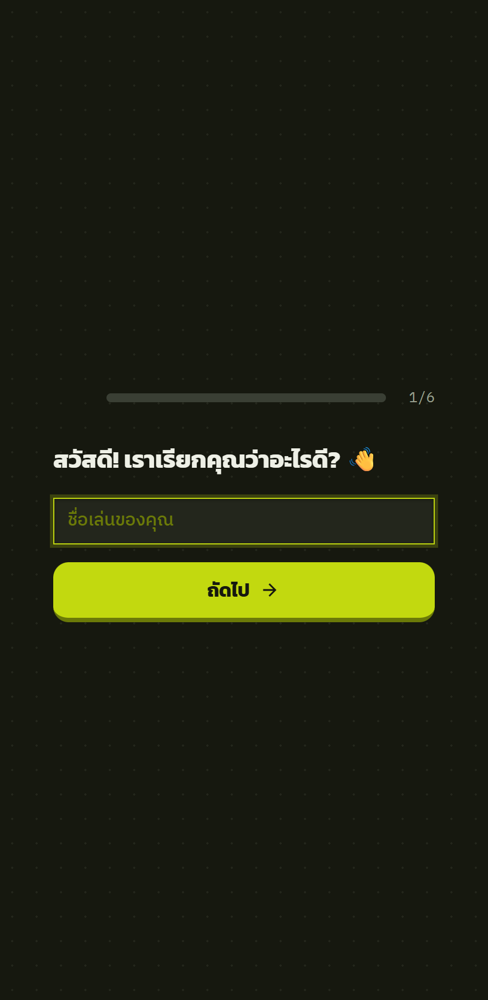

สมัครสมาชิกแบบ **conversational** 6 ขั้น (1 คำถาม/หน้า) พร้อม progress bar:
1. ชื่อเล่น
2. ระดับชั้น (ม.3–ม.6)
3. สายการเรียน
4. โรงเรียน + GPAX *(ไม่บังคับ)*
5. คณะที่สนใจ (เลือกได้หลายอัน)
6. อีเมล + รหัสผ่าน → บันทึกลง Supabase

### 5.3 หน้าหลัก (Dashboard)

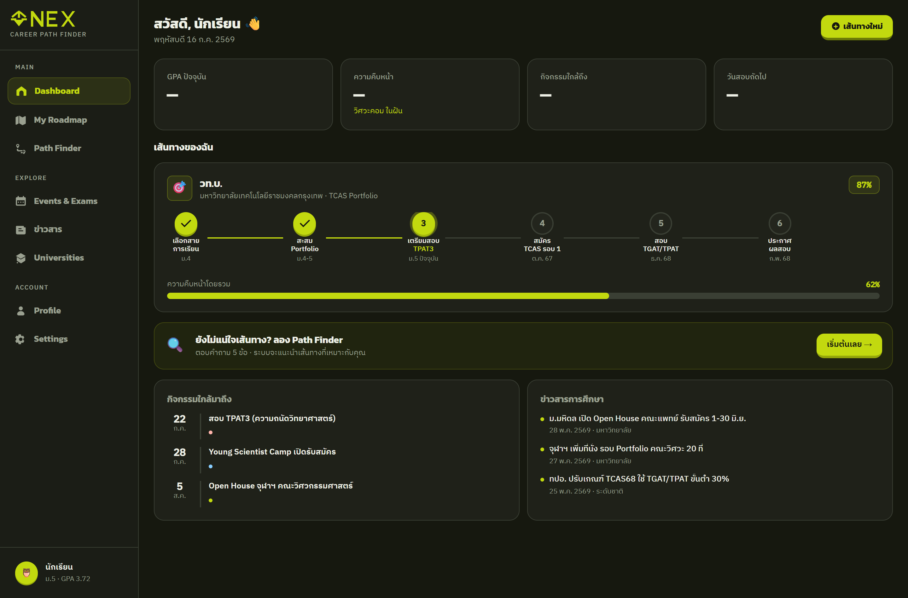

ศูนย์รวมข้อมูล:
- **การ์ดสถิติ 4 ช่อง** — GPA / ความคืบหน้า / กิจกรรมใกล้ถึง / วันสอบถัดไป
- **เส้นทางของฉัน** — roadmap แนวนอนพร้อม progress bar
- **Path Finder banner** — ปุ่มค้นหาเส้นทาง
- **กิจกรรม + ข่าวสาร** (ดึงสดจาก Supabase แบบ real-time)

### 5.4 สร้างเส้นทางใหม่ (เลือกสายการเรียน)

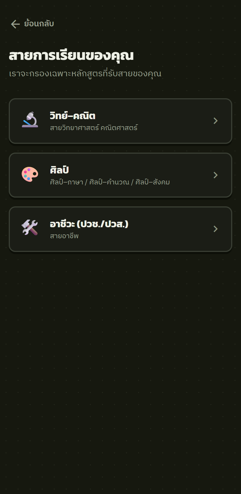

เลือกสาย → ระบบกรองเฉพาะหลักสูตรที่รับสายนั้น (วิทย์–คณิต / ศิลป์ / อาชีวะ) แล้วเลือกคณะ → หลักสูตร → ดู roadmap

### 5.5 My Roadmap

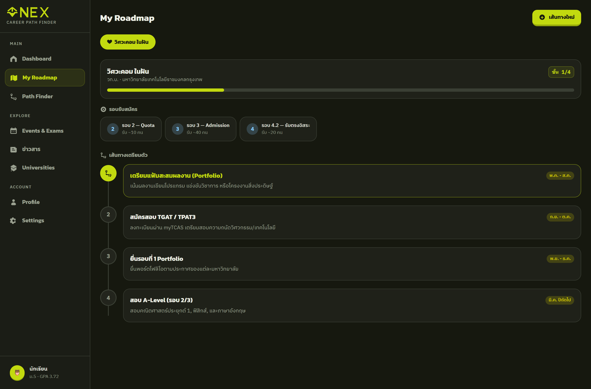

- เลือกเส้นทางจาก chip ด้านบน (❤️ = เส้นทางหลัก)
- **รอบรับสมัคร TCAS** — แตะเพื่อดูวิชา + น้ำหนัก%
- **เส้นทางเตรียมตัว** — timeline แต่ละขั้นตอน (ปัจจุบันเรืองแสงไลม์)

### 5.6 ข่าวสารการศึกษา

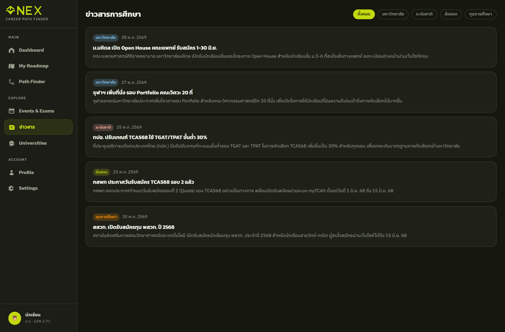

ข่าว TCAS จริงจาก Supabase — กรองตามหมวด (ระดับชาติ / มหาวิทยาลัย / ข้อสอบ / ทุนการศึกษา)

### 5.7 ปฏิทิน TCAS

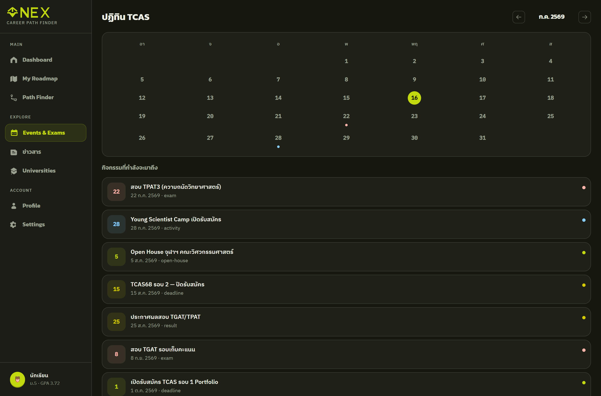

ปฏิทินรายเดือน (วันนี้ไฮไลท์ไลม์, จุดสีตามประเภทกิจกรรม) + รายการกิจกรรมที่กำลังจะมาถึง

### 5.8 สายอาชีพ (Path Finder)

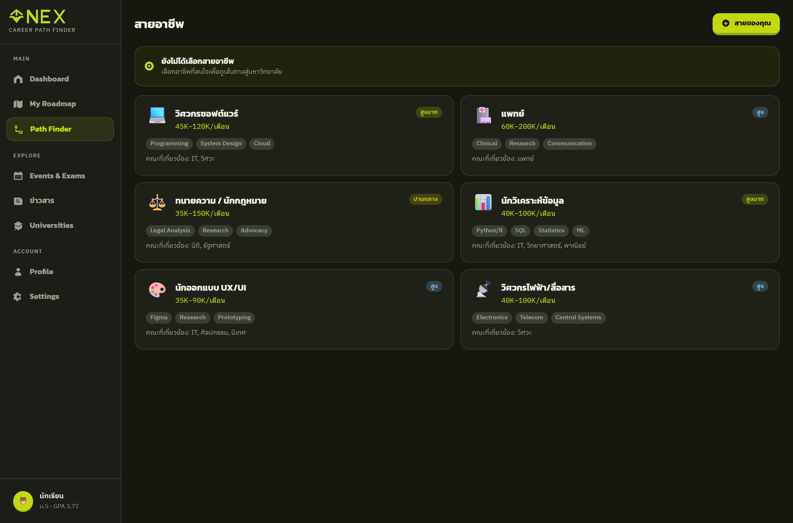

การ์ดอาชีพพร้อมเงินเดือน / ความต้องการตลาด / ทักษะ / คณะที่เกี่ยวข้อง

### 5.9 มหาวิทยาลัย

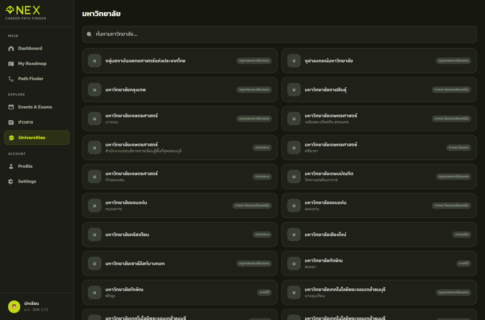

รายชื่อมหาวิทยาลัย 141 แห่ง — ค้นหาแบบ real-time

### 5.10 โปรไฟล์ & ตั้งค่า

<p>
  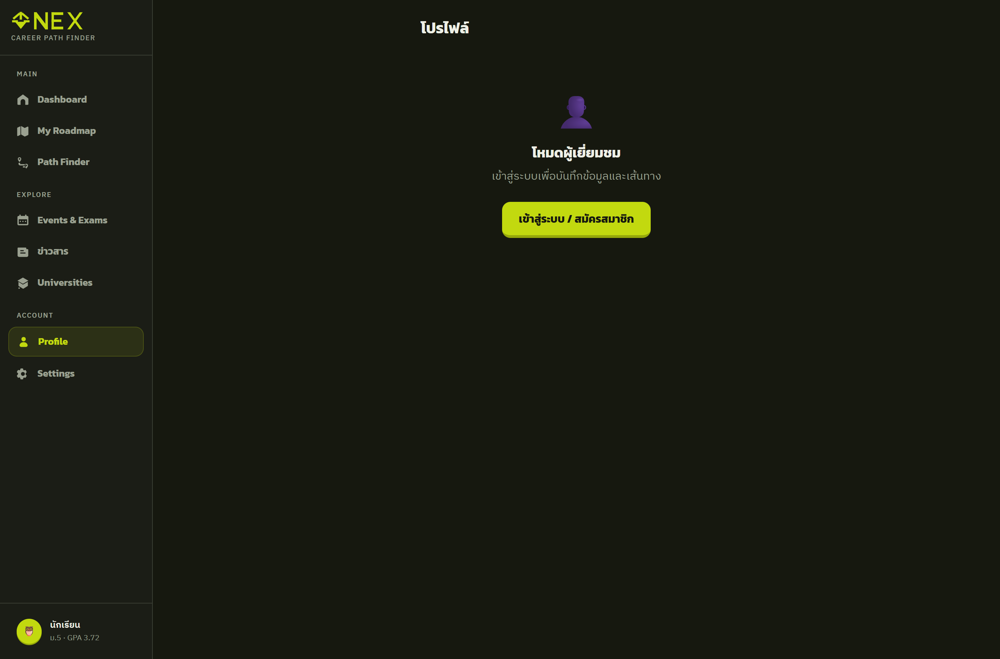
  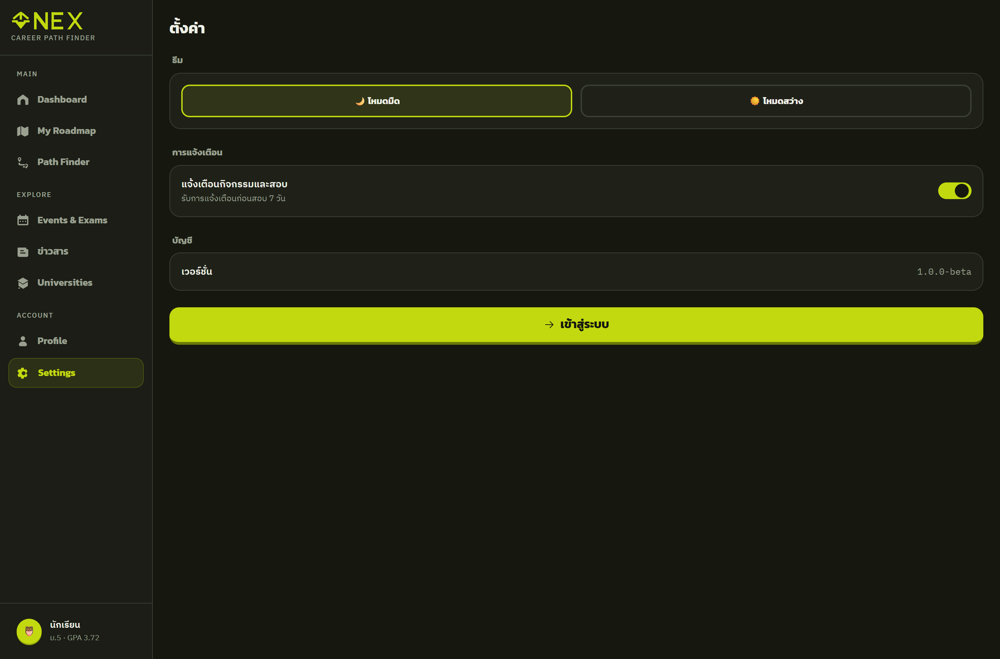
</p>

- **โปรไฟล์** — อัปโหลดรูป, แก้ชื่อ/ชั้น/โรงเรียน/GPAX (sync กับ onboarding)
- **ตั้งค่า** — สลับโหมดมืด/สว่าง, การแจ้งเตือน

### 📱 รองรับมือถือ

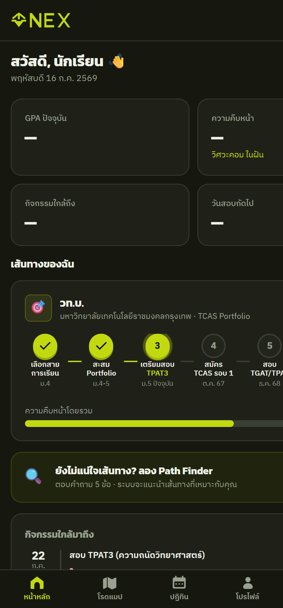

หน้าจอปรับตามอุปกรณ์ — มือถือใช้ bottom navigation แทน sidebar

---

## 6. โครงสร้างโปรเจกต์

```
nextstep-demo/
├── index.html          # หน้าหลัก + Tailwind config + splash
├── serve.js            # Node dev server
├── css/
│   └── styles.css      # ธีม, tactile buttons, animations
├── js/
│   ├── config.js       # Supabase URL + key
│   ├── app.js          # router, dashboard, roadmap, flow
│   ├── views.js        # news, calendar, career, uni, profile, settings
│   ├── onboarding.js   # ระบบสมัคร 6 ขั้น
│   └── icons.js        # Streamline Solar Bold icons
├── assets/
│   ├── logo.js         # โลโก้ NEX (SVG)
│   └── logo.svg
└── docs/
    ├── INSTALL_GUIDE.md
    └── images/         # ภาพประกอบ
```

---

## 7. การแก้ปัญหาที่พบบ่อย

| ปัญหา | สาเหตุ | วิธีแก้ |
|-------|--------|---------|
| หน้าขาว / ไม่โหลดข้อมูล | เปิดผ่าน `file://` | ต้องรัน `node serve.js` แล้วเปิดผ่าน `http://127.0.0.1:5173` |
| `node: command not found` | ยังไม่ติดตั้ง Node.js | ติดตั้งจาก [nodejs.org](https://nodejs.org) |
| ข้อมูลไม่ขึ้น (ข่าว/หลักสูตร) | เน็ตหลุด / Supabase ล่ม | เช็คอินเทอร์เน็ต, เปิด DevTools ดู Console |
| Google login ไม่ทำงาน | ยังไม่เปิด provider | เปิด Google ใน Supabase Dashboard → Authentication → Providers |
| พอร์ต 5173 ถูกใช้ | มีโปรเซสอื่นใช้อยู่ | `PORT=8080 node serve.js` |

---

## 🎨 ระบบดีไซน์

- **สี:** พื้นเข้ม `#16180f` · accent ไลม์ `#c2d90f` · ตัวรอง `#9aa090`
- **ฟอนต์:** Kanit (หัวข้อ) · IBM Plex Sans Thai (เนื้อหา) · IBM Plex Mono (ตัวเลข)
- **ธีม:** dark เป็นค่าเริ่มต้น + สลับ light ได้

---

<p align="center">
  <strong>NEXTSTEP</strong> — ก้าวต่อไปสู่มหาวิทยาลัยในฝัน 🎓<br/>
  <sub>Career Path Finder · TCAS · ม.3–ม.6</sub>
</p>
